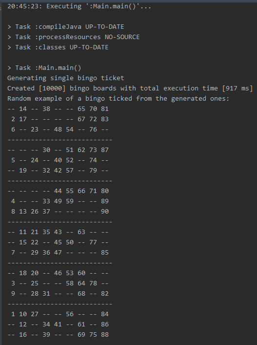

# Bingo 90 Challenge

Code submission for the bingo [ticket generator challenge](https://github.com/lindar-open/ticket-generator-challenge)

## Overview

Project is implemented as a Java console app, written in Java 17, using gradle for build.
The console app is accompanied by unit tests written with JUnit5.

The basic approach of the solution is to generate the bingo board row by row, while checking that newly generated row is
not breaking the constraints imposed on each column. By generating each row, algorithm ensures that each row will have
exactly 5 numbers and 4 blank spaces.

First step is to generate the 18x9 bingo board populated with only the blanks. After which the application fills in the
rest of the numbers. Numbers are filled in per column, since each column has exact set of numbers it must contain. Each
column is filled by taking a random permutation of its numbers, which are then inserted into the board while skipping
the blanks. This step also ensures that all numbers within one column inside one strip (3 rows) are ordered in
descending order as described in the requirements.

## Randomness

Creating each row consists of generating 4 indices that will place the blanks into that row, and it's based on
the `RangeGenerator` interface, which provides a method to generate a new list of indices. I've created two different
implementations of this interface.

One is `ShuffleGenerator` which relies on built-in methods `Collections.shuffle(...)` to generate a random permutation
out of row indices, out of which only required number for blanks is taken, so a sub list of 4 elements basically.

The second one is `CombinatoricGenerator` which initially creates a list of all possible permutations of 4 objects out
of set of 9 (total number of columns) and stores them in memory. Since we don't care for the order in which the indices
are created, then a total number of permutations is greatly reduced. So the total number of possible permutation of 4
objects out of a set of 9 is `9! / (4! * 5!) == 126` which is easily stored in memory. When generating a new row, it
just picks one random item in that list. This approach is a bit faster but does have initial overhead when first
generating the list of permutations.

## Testing

Unit tests are implemented for `BingoGenerator` class, which takes care of generating each bingo board. For each of the
above-mentioned random generators there are tests checking creation of a single board, and it's validity according to
the provided rules and constraints. A similar pair of tests was implemented to ensure that the algorithm will generate a
valid bingo board every time (tested with a batch of 100 for each approach). And finally there is a pair of tests which
cover the case of generating 10k bingo boards under 1 second of total execution time.

## Example and performance

In the `main` method, application generates 10k bingo90 boards using `ShuffleRangeGenerator`.
For 10k bingo boards execution lasts approx. 0.7 seconds.

Following is the screenshot for one of the executions, with a random board printed out as an example:

